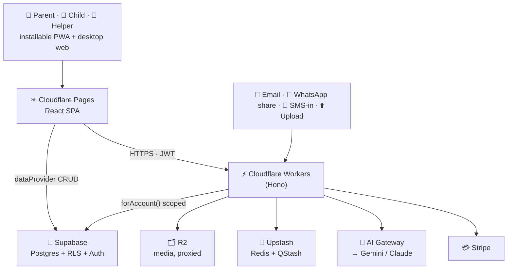
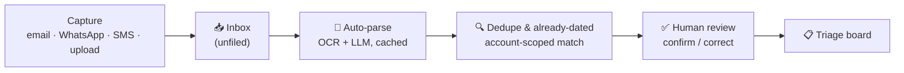

<div align="center">

# ✨ MyShadchan

### The organised memory for the shidduch process.

A private, mobile-first CRM that helps a **parent** — or a **single** — manage the entire
shidduch journey across **many shadchanim**: every suggestion, resume, reference call, and
date, all in one calm place. It captures resumes from the channels they actually arrive on,
remembers everything against the right person, and quietly catches the *"wait, have we seen
him before?"* moments before they get embarrassing.

<br/>


**🆓 Free core, forever  ·  💜 Non-profit, funded at cost  ·  🔒 Privacy by default  ·  📖 Source-available**

</div>

---

> **9pm. A shadchan WhatsApps a resume.** You half-remember the name… was it someone Mrs. Klein
> already suggested? Did your daughter *date* him last winter? You hunt across WhatsApp, a Google
> Sheet, a binder — Hebrew spelling vs English — and come up empty. By morning it's buried, and the
> same boy gets "freshly" suggested all over again.
>
> **MyShadchan is the tool that remembers for you.** One tap to capture, and it checks that resume
> against every past suggestion *and* your child's dating history — then quietly surfaces:
> *"⚠ Mrs. Klein suggested him 3 months ago — you said *For-sure-not*."*
> That's the **"oh thank goodness"** moment this whole project is built around.

> [!IMPORTANT]
> **MyShadchan is not a matchmaking service and never networks your data.** It's built for the
> *parent's side* of the process — your own private organised memory. There is **no pooled or public
> database of families**; your data is yours, fully exportable and deletable, and is never shared
> without your consent.

---

## 🌟 Why MyShadchan exists

In the Orthodox Jewish community, a parent redting shidduchim for their children speaks to *many*
shadchanim and receives a constant stream of resumes — yet there's **no tool built for the parent's
side** of this. Everything out there serves *singles*, *resume-building*, or *shadchanim managing
their pool* — leaving parents on spreadsheets, WhatsApp threads, phone notes, and physical binders.

The result is a **crisis of process**: losing track of which shadchan suggested what, the status of
each suggestion, what the references said, whether someone was *already* suggested, or whether your
child *already dated* them.

**MyShadchan is the single source of truth for that process** — the organised memory for an
inherently disorganised, high-volume, emotionally charged job. Built for **Chani**: a Lakewood mother
with two children in shidduchim, hugely disorganised, phone-first, always on WhatsApp, doing this
between everything else. She isn't an edge case — she's *the* user.

<sub>💡 New to the vocabulary? There's a quick **[glossary](#-glossary)** at the bottom.</sub>

---

## 💫 What it does

<table>
<tr>
<td width="50%" valign="top">

### 📥 Capture from anywhere
No smartphone required. A resume reaches your Inbox by **email forward/CC**, **WhatsApp share**
(1-tap on Android), **inbound SMS**, or plain **upload** — so iPhone, kosher/basic-phone, and
desktop-only users are all first-class.

### 🔍 The duplicate & "already-dated" catch — *the wedge*
On capture, MyShadchan checks each single against every past suggestion **and** your child's dating
history — on **name + parents + seminary/yeshiva + Shul + location**, across **Hebrew ↔ English**
spellings. It flags with a confidence level; **nothing ever auto-merges.**

### 📋 A calm triage pipeline
A single board with clear states — *New → Look-into → Not-sure → For-sure-not*, then a post-diligence
*Yes / Unsure / No*. A gut "no" is kept distinct from a considered "no." Drag on desktop, quick-move
on mobile.

### 📞 A real reference system
Reusable reference contacts, per-call status, what-they-said logs, and **repeat-reference
recognition** — so a recurring reference surfaces every prior conversation across singles.

</td>
<td width="50%" valign="top">

### 🤖 Auto-parse (AI)
OCR + LLM reads a PDF or photo resume and pre-fills identity, family, schools, and references — in
**Hebrew and English**. Always assistive, never authoritative: you review and confirm every field.

### 🧠 AI research assistant (diligence, never matching)
Tailored reference questions by relationship, guided call scripts, and a cross-reference summary that
surfaces **consensus, contradictions, and gaps** ("nobody asked about health"). It **never** judges
compatibility and does **no** outward web-scraping of people.

### 🧑 The single's own dignified login
A calm, curated view of only the suggestions actively being pursued for them — never the pile of
gut-rejections, never a parent's private notes. They can give input on their terms. *The emotional
tone is the feature.*

### 🔗 Revocable resume sharing & 🔔 reminders
Share a resume via a **per-recipient, expiring, access-logged** link that always shows the latest
version — revoke and access is cut instantly. Set reminders against any shadchan, suggestion, or
reference, delivered by email (the guaranteed floor), in-app, and push.

</td>
</tr>
</table>

---

## 💜 Free forever, funded at cost — *not for profit*

MyShadchan is a **community tool, not a business.** Here's the deal, in plain terms:

| | |
|---|---|
| 🆓 **The entire CRM is free — forever** | Capture, Inbox, triage, the duplicate/already-dated **wedge**, references, reminders, sharing, multi-child, the child login, search. The core value is **never** behind a paywall. |
| 🤖 **Only the AI features are paid** | Auto-parse and the AI research assistant run OCR + LLM tokens — the one unavoidable cost. After a free trial, they need a **cost-recovery subscription (~$2/mo)**. |
| 🪙 **Cost-recovery, not revenue** | The price exists **only** to cover real hosting + AI cost — no profit, no salesy funnel, no rabbinic-endorsement gate. Manual entry is always the free fallback for every AI feature. |
| 🔐 **We never sell data** | The ~$2/mo is cost-recovery, *not* data monetisation. No pooled database, ever. |
| 📖 **Source-available** | Licensed under the **Functional Source License (FSL-1.1-ALv2)** — read it, run it, learn from it, contribute; it converts to **Apache-2.0 two years after each release**. The non-compete clause only stops someone cloning it into a competing paid service. |

> **The whole model in one line:** the wedge that makes MyShadchan valuable is free; the AI that costs
> real money pays for itself. That's it.

---

## 🏗️ How it's built

A modern, type-safe, **privacy-by-architecture** stack. MyShadchan began as a fork of the excellent
[Atomic CRM](https://github.com/marmelab/atomic-crm) and is being grown into a multi-tenant,
event-driven, AI-assisted product per the [architecture spine](#-key-documents).



And the heart of it — the **capture → triage** pipeline; every channel converges on one Inbox, and
nothing ever auto-lands in a decision:



### The stack

| Layer | Technology |
|---|---|
| **Frontend** | React 19 · TypeScript · Vite 7 · React Router 7 |
| **Admin framework** | `ra-core` (headless react-admin) + shadcn-admin-kit |
| **UI & styling** | shadcn/ui · Radix UI · Tailwind CSS v4 · lucide icons |
| **Data & forms** | TanStack Query · React Hook Form · Zod |
| **PWA** | `vite-plugin-pwa` — installable, offline-tolerant capture |
| **Data plane** | Supabase — Postgres 15 + **Row-Level Security** + Auth |
| **Server compute** | Cloudflare Workers (Hono) — pipeline, AI, sharing, webhooks, cron, billing |
| **Media** | Cloudflare R2 (zero-egress, Worker-proxied streams) |
| **Async & rate-limit** | Upstash Redis + QStash |
| **AI** | Cloudflare AI Gateway → **Gemini** (Hebrew OCR) + **Claude**; Langfuse tracing |
| **Email / SMS** | Cloudflare Email Routing (in) + Resend (out) · Telnyx (inbound-only SMS) |
| **Billing** | Stripe (card data never touches our servers) |
| **Analytics** | PostHog (product + session replay + surveys) |
| **Testing** | Vitest · Playwright · Storybook |
| **CI/CD** | GitHub Actions → Cloudflare + Supabase |

### Principles baked into the architecture
- 🛡️ **Tenant isolation in the *database*, not the app.** Every row carries an `account_id`; Postgres
  RLS — not application code — is the boundary. Cross-account leaks are designed to be *unrepresentable*.
- 🧩 **Single-owner logic.** Normalization, visibility, suggestion-creation, and entitlement each live in
  *one* place (a Postgres function/trigger) — never duplicated per runtime.
- 🌍 **Bilingual & bidirectional by design.** Hebrew + English throughout — capture, display, search,
  identity matching — with full RTL layout.
- 📱 **No core action ever requires a smartphone.** Dual-surface parity from one codebase.

> 🤝 **Built with an AI agent harness.** Code changes flow through a small team of subagents
> (planner → developer → reviewer → merger) working in isolated git worktrees. Curious how? See
> [`AGENTS.md`](./AGENTS.md) and [`CLAUDE.md`](./CLAUDE.md).

---

## 🚦 Project status & roadmap

> [!NOTE]
> **MyShadchan is in early development.** The product vision is captured in a **final PRD** and a
> **reviewed architecture spine**, and the build is underway on the Atomic CRM foundation. The Cloudflare
> Workers / R2 / AI Gateway layers described above are the *target* architecture we're actively building
> toward — today the app runs on React + Supabase locally.

The build is sequenced into **12 epics** (order of construction, *not* scope — everything below targets
the first release):

- 🔨 **1 · Foundation** — multi-tenant auth, roles + RBAC, row-level security, passwordless login, dual-surface shell, i18n + Hebrew RTL, export/delete
- ⏭️ **2 · Shadchanim & manual suggestions** — shadchan CRUD, the triage pipeline, per-shadchan stats
- ⏭️ **3 · Resume detail & references** — resume folder, notes, reusable reference contacts, conversation logs
- ⏭️ **4 · Dating history & duplicate detection** — the multi-signal, bilingual **wedge**
- ⏭️ **5 · Auto-parse** — OCR + LLM extraction to a full schema
- ⏭️ **6 · Unified Inbox & channels** — email, WhatsApp share, shared SMS-in
- ⏭️ **7 · Reminders & follow-ups** — multi-channel delivery, email as the floor
- ⏭️ **8 · Resume sharing** — revocable, always-current, access-logged links
- ⏭️ **9 · The single's experience** — the child's curated, dignified login
- ⏭️ **10 · AI research assistant** — questions, call scripts, cross-reference summaries
- ⏭️ **11 · Search, dashboard & polish** — global search, per-child dashboard, landing page
- ⏭️ **12 · Billing & entitlements** — free-trial → cost-recovery AI subscription (Stripe)

---

## 🚀 Getting started

You'll need **[Node 24 LTS](https://nodejs.org/)** (see [`.nvmrc`](./.nvmrc)), **Docker** (for local
Supabase), and **Make**.

```sh
# 1. Clone
git clone https://github.com/dniasoff/myshadchan.git
cd myshadchan

# 2. Install everything (frontend, backend, local Supabase)
make install

# 3. Start the full stack (Vite + local Supabase + Postgres)
make start
```

Then open **http://localhost:5173/** and create the first user. 🎉

Prefer to poke around with throwaway data and no backend? Run the in-browser demo:

```sh
make start-demo   # FakeRest data provider — resets on reload
```

**Everyday commands**

```sh
make test         # unit tests (Vitest)
make typecheck    # TypeScript
make lint         # ESLint + Prettier
make build        # production build
make storybook    # component workshop
```

<details>
<summary>🔧 Local backend services (when running <code>make start</code>)</summary>

| Service | URL |
|---|---|
| Frontend | http://localhost:5173/ |
| Supabase Studio | http://localhost:54323/ |
| REST API | http://127.0.0.1:54321 |
| Inbucket (email testing) | http://localhost:54324/ |

</details>

---

## 🤝 Contributing — we'd love your help

**This is a community project, and contributors are genuinely welcome** — whether you're here to fix a
typo, squash a bug, sharpen the Hebrew↔English matching, or build out a whole epic.

1. 💬 **Say hi first for anything non-trivial.** Open an [issue](https://github.com/dniasoff/myshadchan/issues)
   or [discussion](https://github.com/dniasoff/myshadchan/discussions) so we can shape it together before
   you invest time.
2. 🌱 **Grab something small to start.** Look for `good first issue`, docs, tests, accessibility, or i18n
   work — all high-value, low-ceremony ways in.
3. 🛠️ **Follow the house style.** Conventions, architecture, and the AI agent workflow live in
   [`AGENTS.md`](./AGENTS.md) and [`CLAUDE.md`](./CLAUDE.md). TL;DR: small focused files, immutability,
   ≥80% coverage on new code, English in committed files, and privacy behaviour treated as an acceptance
   criterion — not an afterthought.
4. ✅ **Green before you push.** `make lint && make typecheck && make test`.
5. 🔀 **Open a PR** against `main` with a clear description of the *why*.

Please be kind — we follow a [Code of Conduct](./CODE_OF_CONDUCT.md). 💛

**Especially valuable right now:** Hebrew/English identity-matching heuristics · accessibility on both
surfaces · RTL polish · resume-parsing test fixtures · privacy/RLS test coverage · documentation.

---

## 🗣️ Users — tell us what you need

**Your experience of the shidduch process is the spec.** If you're a parent, a single, or a helper who
lives this every day, your feedback shapes what gets built next:

- 💡 **Ideas & pain points** → [open a discussion](https://github.com/dniasoff/myshadchan/discussions)
- 🐞 **Something broken or confusing** → [file an issue](https://github.com/dniasoff/myshadchan/issues)
- 🔒 **Privacy or security concerns** → these get top priority — please flag them

No GitHub account or tech background needed to be heard — if a friend can pass along a note, that counts.
This tool only earns trust by listening. 🙏

---

## 📚 Key documents

The thinking behind MyShadchan is written down and open:

| Document | What's inside |
|---|---|
| 📄 [**Product Requirements (PRD)**](./_bmad-output/planning-artifacts/prds/prd-myshadchan-2026-07-21/prd.md) | The full vision, personas, user journeys, every functional requirement, the privacy pillar, and the billing model |
| 🏛️ [**Architecture Spine**](./_bmad-output/planning-artifacts/architecture/architecture-myshadchan-2026-07-21/ARCHITECTURE-SPINE.md) | The invariants, the multi-tenant data model, the stack, and the capability→architecture map |
| 🧩 [**Solution Design**](./_bmad-output/planning-artifacts/architecture/architecture-myshadchan-2026-07-21/SOLUTION-DESIGN.md) | The detailed technical design companion to the spine |
| 🤖 [**AGENTS.md**](./AGENTS.md) · [**CLAUDE.md**](./CLAUDE.md) | Dev conventions, project structure, and the AI agent harness |

---

## 📖 Glossary

| Term | Meaning |
|---|---|
| **Shadchan** *(pl. shadchanim)* | A matchmaker the parent deals with |
| **Shidduch** *(pl. shidduchim)* | The match / the matchmaking process itself |
| **Redt / suggestion** | A proposed match — the central pipeline object |
| **Candidate / child** | The parent's son or daughter in shidduchim |
| **Resume** | The profile document for a suggested single (bio, family, schools, references) |
| **Reference** | A person listed on a resume who can be called about the single |
| **Shul** | Synagogue — a community / identity signal |

---

## 📜 License & credits

MyShadchan is **source-available** under the **[Functional Source License, Version 1.1
(FSL-1.1-ALv2)](./LICENSE)** — use it, learn from it, contribute; it converts to **Apache-2.0** two
years after each release. The only thing it restricts is cloning MyShadchan into a competing commercial
service.

Portions derive from **[Atomic CRM](https://github.com/marmelab/atomic-crm)** by
[Marmelab](https://marmelab.com), used under the MIT License (retained in
[`LICENSE.md`](./LICENSE.md)) — with deep gratitude for a superb foundation. 🙏

<div align="center">
<br/>

**Built with 💛 for the community — so no suggestion, and no thoughtful "no," ever gets lost again.**

</div>
