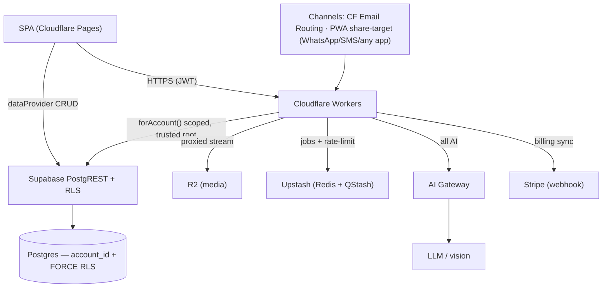
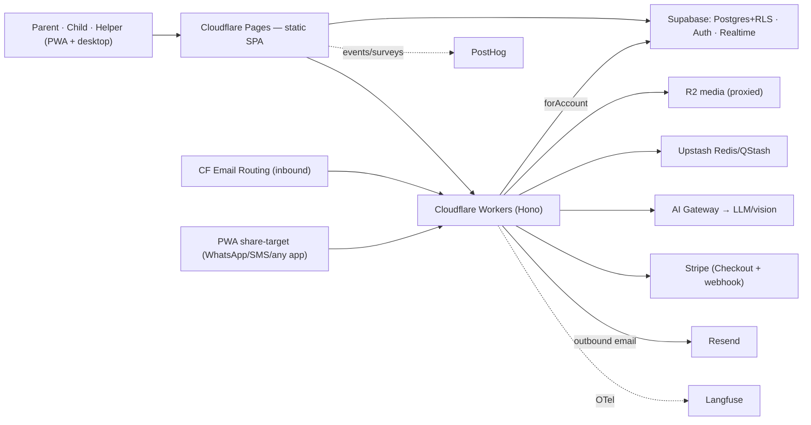
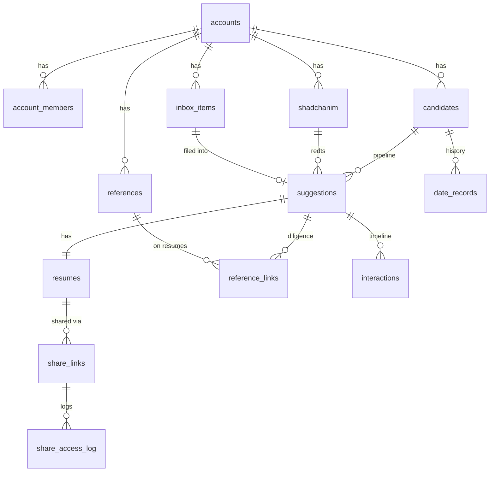
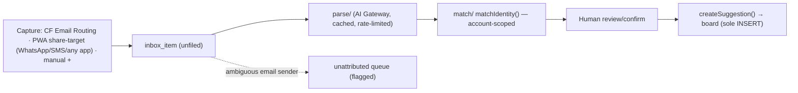

# Architecture Spine — MyShadchan v1

> The invariant spine for MyShadchan v1. Inferred calls are tagged **`[ASSUMPTION]`**. Stack pinned to latest **stable** (version posture = stable-default; latest majors = tracked fast-follow). Hosting/infra chosen for a **generous-free-tier, cost-recovery** product (AI model tokens the one unavoidable cost).

## Design Paradigm

**Three named patterns, one per layer:**

1. **Frontend = the react-admin *Resource pattern*** (ra-core / shadcn-admin-kit). Declarative `Resource`s over one `dataProvider`; components never touch Supabase directly. *(Ratified from the fork.)*
2. **Data core = *defense-in-database* (RLS-first multi-tenant).** Every domain row carries `account_id`; Postgres RLS — not app code — is the isolation boundary.
3. **Ingestion = *pipes-and-filters* (event-driven).** Capture → Inbox → Parse → Dedupe → Triage; every channel converges on one `inbox_item`; nothing auto-lands in a decision state.

**Single-owner rule (gate-hardened, cross-cutting).** Wherever an AD says "one X," it names X's **single owner, writer, and runtime**. Logic more than one runtime touches (normalization, visibility, state transitions, suggestion creation, entitlement) lives in **one place — a Postgres function/trigger**. A shared reader with multiple writers is a divergence bug.

**Layer → home (see AD-7):** SPA (**Cloudflare Pages**, static) · CRUD (Supabase PostgREST + RLS, via dataProvider) · pipeline/AI/sharing/webhooks/cron/billing (**Cloudflare Workers**) · media (**R2**) · async + rate-limit (**Upstash**).

**Namespace map:** `src/components/atomic-crm/<domain>/` (one folder per resource) · `providers/{supabase,fakerest,commons}/` (CRUD seam, AD-10, keep both in sync) · `workers/` *(new — `ingest/ parse/ match/ ai/ share/ cron/ billing/` + shared `forAccount()` client)* · `supabase/schemas/` (declarative DB source of truth).

## Invariants & Rules



### AD-1 — Tenant isolation is `account_id` + RLS, enforced in Postgres (deny-by-default)
- **Binds:** all domain tables; PRV-2, PRV-3; counter-metric "cross-account leaks = 0"
- **Prevents:** any cross-account leak; app-only isolation a new query can forget; an unauthenticated leak through a forgotten policy
- **Rule:** every domain row has non-null `account_id`. Every table has **`FORCE ROW LEVEL SECURITY`** with `USING`/`WITH CHECK` scoped to `current_account_ids()`. **`REVOKE` all table/sequence grants from `anon`** and drop the fork's `anon` default-privilege (`06_grants.sql:69-107,174-177`). **CI asserts every `public` table has `rowsecurity = true`**; each table's migration adds its RLS in the same migration. Polymorphic `interactions`/`tasks` enforce target-account integrity (composite `(account_id,id)` reference or trigger). Views are `security_invoker = on`; **no definer views** (drop `init_state`).

### AD-2 — One membership+role model; the Phase-2 shadchan seat is provisioned but deny-only in v1
- **Binds:** PRV-4; addendum "Phase 2 with no rework"; Epic-1
- **Prevents:** divergent role interpretations; a Phase-2 auth/RLS rebuild; a v1 shadchan membership leaking a whole account
- **Rule:** `account_members(account_id, user_id, role, status)`. Roles = `parent_admin | child_candidate | helper | self_manager` **+ a reserved `shadchan`** in the enum from day one, **granted nothing** in v1 RLS (deny posture, not access) until Phase-2 consent scoping. Authorization derives from membership role, never a hardcoded flag. Retire `is_admin()`/`isInitialized`.

### AD-3 — Intra-account visibility: one SQL policy, exhaustive over every state, extended to child tables, with a hard dignity floor
- **Binds:** PRV-4, UJ-2, FR64-69; child-portal ↔ triage-board seam
- **Prevents:** child login and parent board interpreting "private" incompatibly; the child seeing candid references / parent notes via base tables; any state left unclassified
- **Rule:** visibility is data (`owner_member_id` + `visibility` = `shared | private_parent | private_child`) + per-account `transparency_level`. The **single source of truth is one SQL `SECURITY DEFINER` function** (`child_visible_suggestions()`), called by **both** RLS on `suggestions` **and** the candidate-portal curated views. It classifies **all 7 states exhaustively** (`[ASSUMPTION]` child sees `look_into | yes | unsure`; hidden = `new | not_sure | for_sure_not | no`). Visibility extends to **every child table** (`reference_links`, `interactions`, `resumes`, notes) via join-to-parent RLS. **Floor (un-lowerable): the child always sees their live prospects and can give input.**

### AD-4 — `suggestion` is the central object: one candidate, one canonical state, one creation gate, one transition guard
- **Binds:** FR7, FR14-18; Epic-1/2/4/6; Phase-2 origination
- **Prevents:** competing state machines; a second INSERT path skipping dedup/provenance; a double-represented decision
- **Rule:** **one canonical `pipeline_state` enum** (7): `new · look_into · not_sure · for_sure_not · yes · unsure · no` — decision states reachable **only** from `look_into` (no separate `decision_substate`). Gut `for_sure_not` ≠ post-investigation `no`; both preserved. **One `createSuggestion()` service = the sole INSERT path** (manual-add *and* inbox-filing call it; runs dedup + sets provenance/`visibility`/`owner_member_id`), built in the **foundation** epics. **One `transitionSuggestion()` guard owns every state change.** `origin` ∈ `channel | manual | shadchan` (shadchan reserved).

### AD-5 — Identity matching is ONE account-scoped service, fed by ONE normalizer, never name-only, never auto-merge
- **Binds:** FR10-13, FR20, FR42; NFR-6; R3; "leaks = 0" + PRV-2; Epic-4
- **Prevents:** matching across accounts; capture/filing/history/references normalizing differently; name-only hits; silent merges
- **Rule:** **account-scoped** — every `identity_signals` query carries `account_id`; a match **never** crosses accounts (tested). **One writer:** signals computed by a **single `IMMUTABLE` Postgres normalize function invoked by a trigger** on every write path (parse, manual, `date_records`, reference dedup); the SPA does not normalize. Signals = name (`_en`+`_he`), parents, seminary/yeshiva, Shul, location — not age/height. `matchIdentity()` serves suggestions, dating-history, **and** reference dedup (FR20). Output = candidates + confidence + deciding facts; user confirms/dismisses; **never auto-merges**.

### AD-6 — All channels converge on one `inbox_item`; parse is assistive; attribution is deterministic and never cross-account
- **Binds:** FR1-9, FR22-30, FR78, PRV-7, NFR-5; "mis-routed items = 0"; Epic-5/6
- **Prevents:** a channel writing straight to a suggestion; auto-filing; mis-attributed / cross-account items
- **Rule:** every inbound creates an `inbox_item` (unfiled), then flows through `createSuggestion()` (AD-4) only after human review/confirm. **Channels that converge on the `inbox_item`:** **Cloudflare Email Routing → an Email Worker** (parses raw MIME with `postal-mime`) · the **PWA share-target** (Android share / iPhone Share→Mail — captures WhatsApp, SMS, and *any* app, text + images) · **manual upload**. A share lands in the **sharer's own authenticated account**, so it needs no sender lookup; basic/kosher-phone users capture via desktop email/upload. **There is no shared SMS number and no outbound SMS.** For **email**, **attribution resolves sender → account deterministically**; anything ambiguous/unknown → the **unattributed queue**, flagged, never auto-picked across the account boundary *(the fork's `postmark` silent-first-body-email attribution is a **behavior change**, not a lift-and-shift)*. Channel-derived identity is untrusted → may create only an unfiled `inbox_item` (AD-7). **Optional quick-link at capture (FR78):** the share flow can let the user search the shadchan book (typeahead) and select the candidate and/or attach to an existing suggestion — one tap, fully skippable straight to the unfiled Inbox.

### AD-7 — Compute home = Cloudflare Workers; Supabase = data plane; SPA on Cloudflare Pages; tenant access only via a trusted-root scoped client
- **Binds:** NFR-9, R4; all server-side work; "leaks = 0"
- **Prevents:** split-brain compute; a Worker reading/writing across accounts; scoping to a forgeable root
- **Rule:** the SPA is a static Vite build on **Cloudflare Pages** (free, no commercial-use clause). CRUD goes **SPA → dataProvider → Supabase PostgREST (RLS)**. All other server work (webhooks, REST, AI orchestration, share render, cron, billing, email-in) runs as **Cloudflare Workers**. Because the service role bypasses RLS, the **only** way a Worker touches a tenant table is a **mandatory `forAccount(accountId)` scoped client** that injects/asserts the `account_id` predicate and refuses raw table access — un-scoped access is *unrepresentable*. `accountId` derives from a **trusted root** (verified JWT / verified invite token), trust-ranked; a spoofable channel address caps write surface to an unfiled `inbox_item`. Existing Supabase Edge Functions remain only for DB-trigger-adjacent tasks.

### AD-8 — Every AI call goes through Cloudflare AI Gateway; assistive-only; traced; cost-cached
- **Binds:** FR6, FR19-21, FR55-63, PRV-6, NFR-9; Epic-5/10
- **Prevents:** direct-to-provider calls; uncached cost blow-out; AI drifting into matchmaking; outward scraping
- **Rule:** OCR+extraction, reference-question generation, cross-reference summaries call **only** the Cloudflare AI Gateway from a Worker (provider SDK with `baseURL` overridden). **Hebrew OCR:** the parse step uses **Gemini** (Flash default → Pro for hard pages) via the gateway's Google Vertex/AI-Studio provider, returning structured JSON (typed Hebrew+English is well-handled); a **deterministic fallback — Google Document AI / Cloud Vision, a direct disclosed Google Cloud call** — covers degraded typed pages, and **Transkribus/Kraken** the rare handwritten one; generative-OCR **hallucination is guarded** by field validation + low-confidence human review (AD-6/NFR-5). Every call **Langfuse-traced** (`@langfuse/*` OTel SDK); response cache **namespaced by account**. **Hard invariant (FR63):** never judges compatibility / matches; **no outward web-scraping** (enforced by capability). US region; contractual no-training (PRV-6). *(AI tokens are the product's one unavoidable cost — caching + cheap-model-first + batching are **margin-critical** under the $2 cost-recovery model, AD-16.)*

### AD-9 — User media lives in R2 behind a Worker-proxied stream — recipients never get a raw URL
- **Binds:** FR35, FR47-49, PRV-5, PRV-8, PRV-10; Epic-8
- **Prevents:** static/pre-signed links that outlive a revoke; unlogged access; unencrypted sensitive media
- **Rule:** all user files (resumes, photos) in **R2**, namespaced by `account_id`, served **only** by the `share/` Worker as a **proxied stream** that checks `revoked_at`/`expires_at` and writes `share_access_log` on **every** request. **Recipients never receive a raw or pre-signed R2 URL.** Revoke = immediate; sharer sees who accessed and when. Photo inclusion is the sharer's choice; watermark available. Sensitive fields (health, photos) field-encrypted at rest — `[ASSUMPTION]` app-layer AES-GCM envelope in the Worker (note: a PDF may embed photo/health inline, protected by R2 SSE only).

### AD-10 — The dataProvider is the single CRUD seam; extend at its two seams; keep FakeRest in sync
- **Binds:** all resource CRUD; ratified fork pattern
- **Prevents:** components calling Supabase directly; divergent data-access; a broken demo build
- **Rule:** the frontend reaches data **only** through the `dataProvider`, hooking at the **custom-methods overlay** and the **`ResourceCallbacks[]`** seams. List/summary resources route through a `*_summary` view. Every new resource/method is mirrored in the **FakeRest** provider (build-time selection: `main.tsx`=supabase, `demo/main.tsx`=fakerest).

### AD-11 — Passwordless auth on Supabase; invite binds account + role server-side; 18+ affirmation
- **Binds:** PRV-9, PRV-12, FR64; Epic-1
- **Prevents:** password flows; open self-signup; role mass-assignment / cross-account invites; under-18 accounts
- **Rule:** authentication is **passwordless** — **magic-link / email-OTP is the load-bearing native path**; **passkeys are a progressive enhancement** (Supabase passkeys are Beta — never the sole factor). New users join **only by a verified invite token** (not email match); the invite server-path **binds the row to the inviter's `account_id`** and authorizes `role ≤ inviter authority` (no `role` mass-assignment; never `shadchan`/`parent_admin` from the body). **18+ affirmation** (→ COPPA N/A). Recovery is passwordless.

### AD-12 — Hebrew+English is a data invariant; normalization is the AD-5 Postgres function
- **Binds:** NFR-6, FR6, FR11, FR55; R3
- **Prevents:** English-only fields; a second normalizer in the SPA diverging from the matcher
- **Rule:** names and searchable identity fields store **both** scripts (`*_en`, `*_he`); normalization is the single `IMMUTABLE` Postgres function of AD-5, applied by trigger on every write. No resource assumes a single script.

### AD-13 — Reminders are polymorphic and multi-channel; email is the guaranteed floor; no outbound SMS
- **Binds:** FR44-46, NFR-2; Epic-7
- **Prevents:** smartphone-only delivery; reminders bound to a single entity type
- **Rule:** `tasks(account_id, due_at, target_type ∈ {shadchan,suggestion,reference}, target_id, delivery_channels, done_at)`. A `cron/` Worker sweeps due/overdue and delivers **in-app + email (the guaranteed non-smartphone floor, via Resend) + push (installed PWA)**. **No outbound SMS** (SMS content is captured by share, never sent — AD-6). No delivery path depends on a smartphone.

### AD-14 — Capture is offline-tolerant via a persisted outbox; it never blocks on network
- **Binds:** NFR-1, NFR-3, FR1-3; Epic-1/6
- **Prevents:** a lost capture when offline; capture UX that waits on the server
- **Rule:** capture and Inbox writes enqueue to a **persisted IndexedDB outbox** and sync in the background on both surfaces (extend the fork's mobile React-Query persistence to desktop). `[ASSUMPTION]` service-worker background-sync queue keyed to the account.

### AD-15 — Data lifecycle: export, account deletion, and per-single purge are first-class (the wedge)
- **Binds:** PRV-2, PRV-11, NFR-8, NFR-10; Epic-1/11; **overrides** the fork's "no user deletion" stance
- **Prevents:** the deletion/export promise having no home; orphaned R2 media / AI-cache after delete
- **Rule:** one-click **full account export** (PRV-2/NFR-10). **Account deletion** purges live immediately, clears backups within a defined retention window, and instructs sub-processors to delete per contract. **Per-single purge** (PRV-11) honours a data-subject removal request. Deletion **cascades to R2 objects and the account-namespaced AI cache**. Retention windows are defined, not implicit.

### AD-16 — Billing & entitlement: a provider is the synced source of truth; card data never touches us; freemium gates the cost-drivers
- **Binds:** the $2/mo cost-recovery model; NFR-9
- **Prevents:** client-trusted entitlement; card data in our systems; the free tier bleeding the paid AI cost
- **Rule:** the **billing provider is the source of truth** for subscription state; a **`billing/` Worker** runs Checkout + a **signature-verified, idempotent webhook** that syncs to `accounts` (`stripe_customer_id`/`subscription_status`/`plan`/`current_period_end`/`trial_end`). **Entitlement is derived from the synced state, never trusted from the client.** **Card data never touches our systems** — provider-hosted Checkout + Customer Portal (PCI SAQ-A). **Freemium:** the free tier is the manual CRM/pipeline/dedup/sharing; the **$2/mo tier gates the AI cost-drivers** (metered auto-parse + AI research assistant) `[ASSUMPTION — exact split is a product call]`. **Provider-agnostic** (`[ASSUMPTION]` Stripe). **Fee posture — the fixed per-transaction fee dominates at $2:** bill **annually ($24/yr)** *and* prefer **bank debit — Stripe ACH (0.8%, capped $5, no fixed fee) / SEPA / Bacs, or GoCardless (~1%)** — over cards (2.9%+30¢ ≈ 18% on $2), with **card as the fallback** for users who won't link a bank; Paddle/Lemon Squeezy (5%+50¢) only if international VAT handling outweighs the fee.

### AD-17 — Abuse prevention & rate limiting on every expensive or abuse-prone surface; fail-closed on paid paths
- **Binds:** NFR-4, NFR-9, NFR-13, PRV-7; the cost-recovery margin
- **Prevents:** cost-abuse of the AI pipeline; signup/invite/magic-link spam & enumeration; channel flooding; share-link scraping
- **Rule:** per-account **and** per-IP limits on: the **AI/parse pipeline** (cost — margin protection), **auth/magic-link/invite** (enumeration + spam), **channel ingestion** (flooding), **share-link access** (scraping), **signup** (fakes). Mechanism: **Cloudflare WAF rate-rules + Turnstile** (free CAPTCHA) at the edge + **Upstash Redis token-bucket** for app-level per-account limits (**not** Cloudflare KV — its 1k-writes/day free cap can't hold counters). **Fail-closed** on the paid AI paths.

### AD-18 — UI is internationalized and bidirectional; browser-detected; English + Hebrew to start
- **Binds:** NFR-6, NFR-7, NFR-12; the whole SPA + candidate portal
- **Prevents:** hardcoded English strings; a layout that breaks under Hebrew RTL; two components handling text direction incompatibly
- **Rule:** all UI text goes through the ratified ra-core **`i18nProvider`** (polyglot) — **no hardcoded UI strings** — with **English + Hebrew** catalogs to start (extensible: one catalog per locale). Locale is **auto-detected from the browser** (`navigator.language` → supported locale, default English) with a **persisted user override**. The app is **bidirectional**: the root `dir` flips per locale and layout uses **CSS logical properties** (Tailwind `ms-/me-/ps-/pe-`, never `ml-/mr-`) so components mirror for Hebrew RTL; Radix/shadcn receive `dir`. *(Distinct from AD-12, which governs bilingual **data**; this governs the **UI**.)* `[ASSUMPTION]` Hebrew catalog via `ra-language-hebrew` + authored domain strings; the fork is LTR-only today, so RTL is a cross-cutting audit.

## Consistency Conventions

*(Ratified from repo rules `.claude/rules/*` + gate-hardened tenancy rows.)*

| Concern | Convention |
| --- | --- |
| Naming — code / DB | camelCase · PascalCase · UPPER_SNAKE · `use*` hooks; snake_case columns, snake_case-plural resources; English-only in committed files. |
| IDs / dates / bilingual | domain rows `bigint identity`; `account_id bigint` non-null everywhere; `auth.users.id` uuid; `timestamptz`; names store `_en`/`_he`. |
| Single-owner logic | normalization, visibility, suggestion-creation, state-transition, entitlement each in **one** Postgres function/trigger — never per-runtime (AD-3/4/5/12/16). |
| Tenant scope | every table ships `account_id` + `FORCE` RLS in one migration; `anon` has **no** table grants; Workers touch tenant tables **only** via `forAccount()`; CI asserts RLS on every `public` table + no definer views. |
| Worker API / validation | JSON envelope `{ success, data?, error?, meta? }`; validate every boundary with **Zod** (no `any`; `unknown`+narrow). |
| State (frontend) | server → TanStack Query; shareable UI → URL; forms → RHF; immutable updates. |
| i18n / bidi | all UI strings via the `i18nProvider` (no hardcoded text); CSS **logical properties** for direction (`ms/me`, not `ml/mr`); root `dir` per locale; RTL-test Hebrew (AD-18). |
| Errors / observability | explicit handling; friendly message to user, structured context to logs; no `console.log` in prod. v1 backend errors → **Cloudflare Workers native observability** (Logs/Tail/Logpush); Sentry Phase 2. |
| Security (Workers) | HSTS · `X-Content-Type-Options` · `X-Frame-Options: DENY` · `Referrer-Policy` · `Permissions-Policy`; nonce-CSP; CSRF + rate-limit (AD-17) on state-changing endpoints; secrets never in client; **Stripe webhook signature verified**. |
| Files / testing | 200–400 lines typical, 800 max; ≥80% new-code coverage; AAA; Playwright deterministic waits; **RLS test suite per table** (incl. cross-account attempts from a Worker); FakeRest fixtures updated per resource. |

## Stack

*(SEED — verified live against official sources on 2026-07-21. Version posture = **stable-default** (majors held at CI-green lines; verified-latest = tracked fast-follow). Infra chosen for generous free tiers; ✅ = free, ⚠ = free-with-caveat, 💲 = small unavoidable cost.)*

| Name | Version / choice |
| --- | --- |
| Node.js LTS | 24.18.0 (`.nvmrc`; not 26.x non-LTS) |
| React + React DOM | 19.2.8 |
| Vite + `@vitejs/plugin-react` | 7.3.6 + 4.6.x · latest = fast-follow |
| TypeScript | 5.8.3 · latest = fast-follow |
| react-router | 7.18.1 · latest = fast-follow |
| ra-core / ra-data-fakerest · ra-supabase-core | 5.15.0 · 3.5.2 |
| Tailwind CSS + `@tailwindcss/vite` | 4.3.3 |
| TanStack Query · RHF · Zod | 5.101.4 · 7.82.0 · 4.4.3 |
| vite-plugin-pwa | 1.3.0 |
| `@supabase/supabase-js` / CLI | 2.110.8 (stay 2.x) / 2.109.1 |
| **SPA host** | ✅ **Cloudflare Pages** (unmetered bandwidth, no commercial clause) |
| **Server compute** | ✅ **Cloudflare Workers** + Wrangler 4.113.0 / workers-types 5.20260721.1 · `compatibility_date=2026-07-21` + `nodejs_compat`; Hono 4.x `[ASSUMPTION]` |
| **Data plane** | ⚠ **Supabase** Postgres 15 (free tier pauses after 7d idle → Pro ~$25/mo for always-on = first real cost) |
| **Media** | ✅ **Cloudflare R2** (zero egress) |
| **Async + rate-limit** | ⚠ **Upstash** Redis 1.38.0 / QStash 2.11.2 *(CF Queues now free = consolidation option)* |
| **AI** | ✅ Cloudflare AI Gateway (free) → **Gemini** (OCR+extract; Flash→Pro; Google Vertex/AI-Studio) + `@anthropic-ai/sdk` 0.112.4, via gateway `baseURL`; deterministic OCR fallback = Google Document AI/Vision (direct); 💲 model tokens billed by provider · Langfuse `@langfuse/*` 5.9.1 (self-host MIT = free) |
| **Analytics** | ✅ PostHog `posthog-js` 1.406.1 / `-node` 5.46.0 (errors + replay + surveys) |
| **Email** | ✅ inbound = **Cloudflare Email Routing → Email Worker** (`postal-mime`, free/unlimited) · ⚠ outbound = **Resend** 6.18.0 (3k/mo + 100/day shared) |
| **Capture (WhatsApp/SMS/any app)** | ✅ **PWA share-target** (Android) + **Share→Mail→inbox** (iPhone) — text + images into the sharer's own account; no shared SMS number, no Telnyx |
| **Billing** | 💲 **Stripe** (provider-agnostic AD-16; annual $24/yr rec; Paddle/Lemon Squeezy if intl VAT wanted) |
| **Abuse** | ✅ Cloudflare WAF rate-rules + Turnstile (free) + Upstash Redis token-bucket |
| Dev tooling | ESLint 9.22 + typescript-eslint 8.65 · Prettier 3.9.6 · Vitest 4.1.10 · Playwright 1.61.1 · shadcn 3.5 · Storybook 9.1.20 |
| CI/CD | ✅ GitHub Actions (Supabase + Cloudflare via wrangler) — **use a public repo for unlimited free minutes** |

**Always-on cost floor** ≈ Supabase Pro $25/mo + AI tokens → **~$25/mo + AI**; **$2/mo × ~15 families covers it.** Everything else sits on a generous free tier.

## Structural Seed




*`accounts` also carries billing state (`stripe_customer_id`, `subscription_status`, `plan`, `current_period_end`, `trial_end` — AD-16).*



### Operations (v1)
- **Deploy surfaces (all Git-driven):** Cloudflare Pages (SPA) + Cloudflare Workers (`wrangler deploy`) + Supabase (`db push` + functions) — via GitHub Actions. **Public repo → unlimited free CI.**
- **Environments:** dev (local Supabase + `wrangler dev`) · preview (`[ASSUMPTION]` CF Pages preview + Supabase branch + preview Worker) · prod. **US region** (US-first; UK/Israel internationalization deferred — see Deferred).
- **Observability:** PostHog (product + errors + replay + surveys) · Cloudflare Workers native (backend) · Langfuse (AI). Sentry → Phase 2.
- **Data protection:** backup/DR + retention per AD-15; secrets are Worker/Actions secrets, never in the client bundle.

### Source tree (new work in **bold**)
```text
src/components/atomic-crm/
  providers/{supabase,fakerest,commons}/   # AD-10 CRUD seam (keep both in sync)
  shadchanim/ suggestions/ candidates/     # rebuilt from contacts/companies/deals
  resumes/ references/ dates/ inbox/        # new resources
  reminders/ sharing/ candidate-portal/     # new resources (portal = UJ-2, AD-3)
  billing/                                  # freemium entitlement UI (AD-16)
workers/                                    # NEW — Cloudflare Workers (Hono)
  ingest/ parse/ match/ ai/ share/ cron/ billing/   # + shared forAccount() client
supabase/schemas/                           # + account_id/FORCE-RLS rewrite, revoke anon,
                                            #   normalize()+child_visible() SQL fns, billing cols
```

## Capability → Architecture Map

| Epic / capability | Lives in | Governed by |
| --- | --- | --- |
| E1 Foundation · tenancy · RBAC · passwordless · dual-surface · export/delete | `providers`, `supabase/schemas`, `candidate-portal` | AD-1,2,3,11,14,15 |
| E2 Shadchanim + suggestion gate + pipeline | `shadchanim`, `suggestions` | AD-4, AD-10 |
| E3 Resume detail + references | `resumes`, `references` | AD-4, AD-9, AD-10 |
| E4 Dating history + duplicate detection | `dates`, `match/` | AD-5, AD-12 |
| E5 Auto-parse (OCR+LLM) | `parse/` | AD-6, AD-8, AD-12 |
| E6 Unified Inbox + channels | `inbox/`, `ingest/` | AD-6, AD-7 |
| E7 Reminders | `reminders`, `cron/` | AD-13 |
| E8 Resume sharing | `sharing`, `share/`, R2 | AD-9, AD-15 |
| E9 Candidate portal | `candidate-portal` | AD-3 |
| E10 AI research assistant | `ai/` | AD-8 |
| E11 Search · dashboard · export | across resources | AD-1, AD-10, AD-15 |
| Billing | `billing/`, `workers/billing` | AD-16 |
| Abuse / rate-limiting | edge + every Worker | AD-17 |

## Deferred
- **Phase-2 shadchan interface** — role provisioned deny-only (AD-2); UI/origination/consent-scoping later.
- **Native iOS wrapper** — stay pure-PWA (email-share) until the iPhone segment warrants it.
- **Cloudflare consolidation** — CF Queues/KV (now free) vs Upstash; already all-Cloudflare for host/compute/media/email.
- **Sentry** — Phase 2; v1 backend errors = Cloudflare native + PostHog.
- **International (UK/Israel)** — US-first in v1; UK/Israel users, data-residency, and locale rollout (UK-GDPR / EU-GDPR / Israeli privacy) are a deferred fast-follow.
- **Merchant-of-Record billing** (Paddle/Lemon Squeezy) — adopt if international VAT handling for UK/Israel outweighs the higher fee.
- **Supabase Pro / scale** — the first paid line as usage grows (7-day pause + 500 MB).
- **Workers AI · deep shidduch-site integration · numeric SLOs** — as drivers appear.

## Open questions
1. **Field encryption** — app-layer envelope in the Worker (drafted) vs Supabase Vault (note the PDF-embeds-photo/health boundary, AD-9).
2. **Worker routing** — Hono assumed.
3. **Freemium split** — which features are $2 premium (drafted: the AI cost-drivers — auto-parse + research assistant, metered).
4. **Billing provider / low-fee method** — recommend **annual + bank debit** (Stripe ACH/SEPA/Bacs or GoCardless ≈ 1%, ~pennies/txn) with card fallback; Paddle/Lemon Squeezy (MoR, VAT-handled) only if the tax convenience beats the higher fee. *(Second-order to the ~$25/mo cost floor.)*
