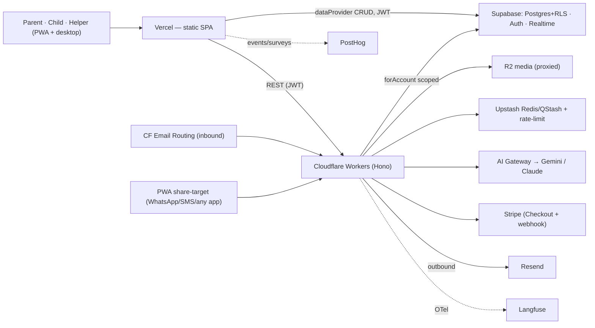
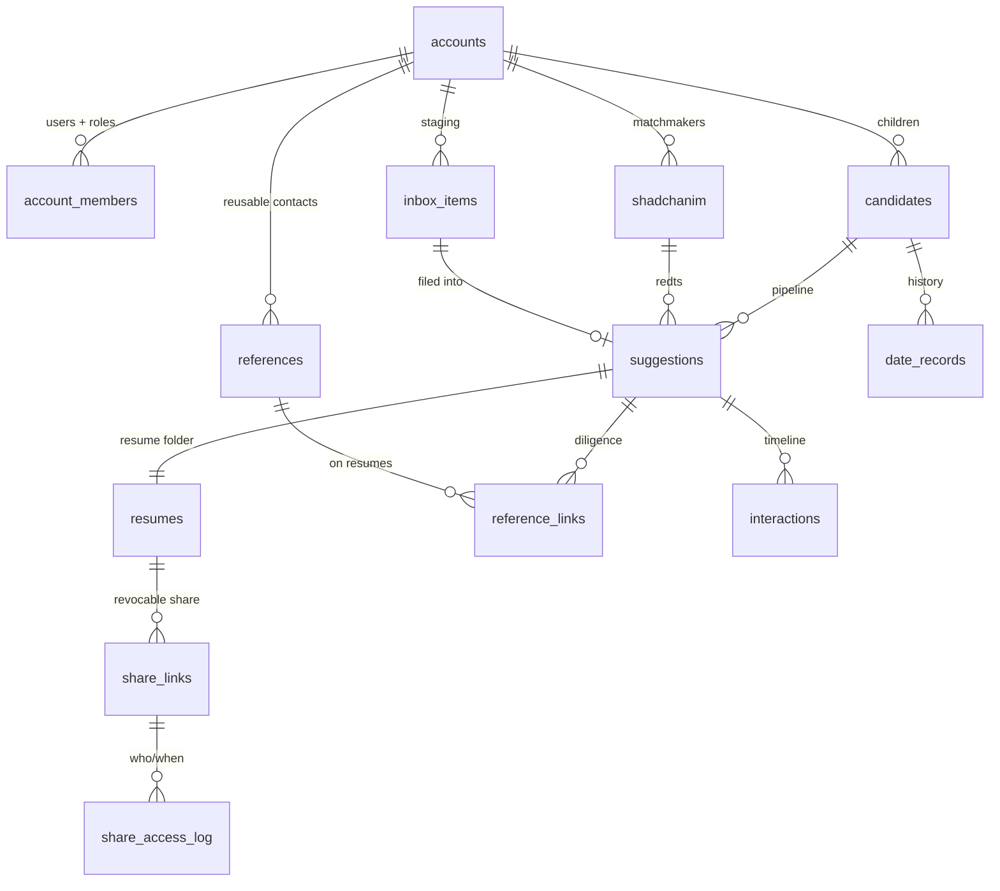
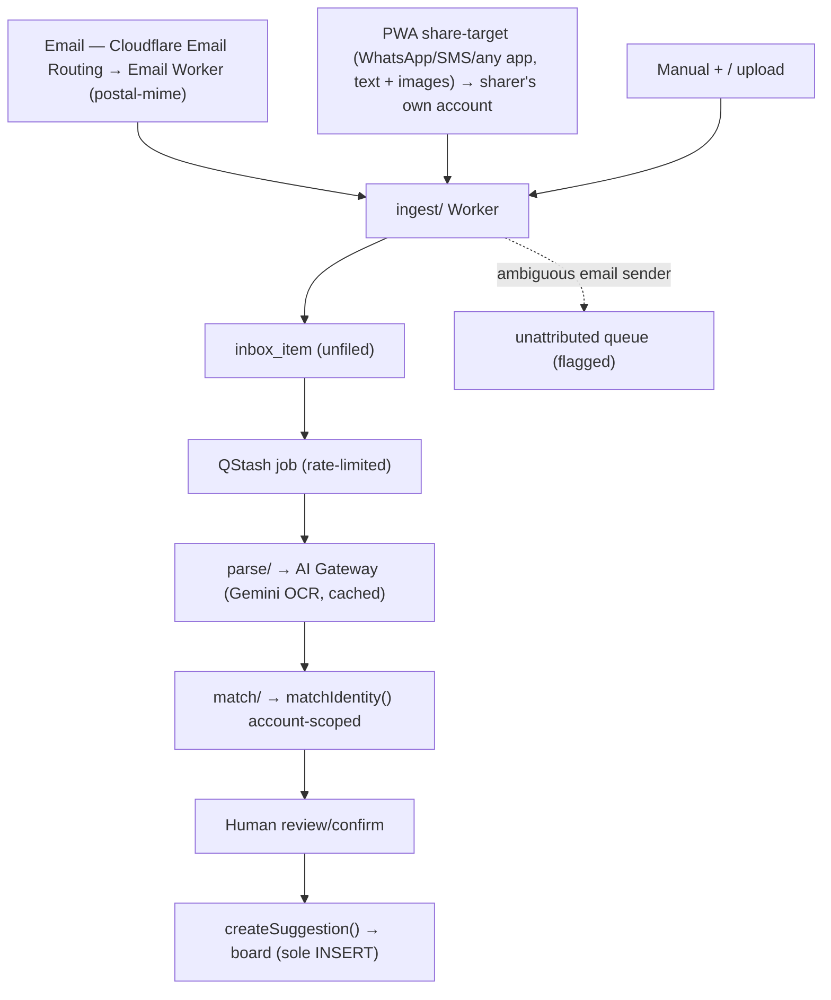

# MyShadchan v1 — Solution Design

> Fuller companion to `ARCHITECTURE-SPINE.md` — rationale, operational envelope, cost posture, and the build path the spine omits. **Where they disagree, the spine wins.** Tracks the spine's 18 ADs. Inferred calls tagged **`[ASSUMPTION]`**.

---

## 1. How to read

- **PRD** = *what & why*. **Spine** = *the 18 invariants (ADs)*. **This doc** = *how it's built* + the cost/ops reality.
- Internalise the spine's **single-owner rule** first: every "one X" (matcher, visibility policy, suggestion-creation gate, transition guard, normalizer, entitlement) has one owner/writer/runtime, and cross-runtime logic lives in **one Postgres function/trigger**.
- The stack is chosen for **generous free tiers** (cost-recovery product); **AI model tokens are the one unavoidable cost**.

---

## 2. Starting point — fork vs net-new

Fresh fork of **Atomic CRM**; domain code ≈ 0% adapted.

**Ratified:** the react-admin Resource pattern over one `dataProvider` (two seams + `*_summary` views); Supabase (Postgres/Auth/Storage/Realtime) + the declarative `schemas/` workflow + the `auth.users→app-user` trigger; Vite + vite-plugin-pwa; the JWKS-verified auth foundation; **the ra-core `i18nProvider`** (polyglot, ships en+fr — the i18n machinery for AD-18); the `.claude/rules/*` conventions.

**Net-new:** multi-tenancy + RLS (fork is `using(true)` everywhere, `anon` over-granted); RBAC + the dignity-floor visibility model; passwordless auth; the whole Cloudflare `workers/` plane; pipeline/matching/AI/sharing/export-delete; PWA `share_target` + offline outbox; **billing + entitlement (AD-16)**; **abuse/rate-limiting (AD-17)**; **Hebrew + RTL i18n (AD-18 — the fork is LTR-only today, a real cross-cutting audit)**.

---

## 3. Stack, environments & cost

**Cloudflare-first for backend compute/media, Vercel for the SPA** (2026-07-22 decision, overriding the original Cloudflare Pages call below): **R2 zero egress** is the dominant saving (resume files/photos served repeatedly); Workers are cheap and co-locate with the AI Gateway. The SPA deploys to **Vercel** (already wired up via Git integration + `vercel.json`). Supabase stays the data plane (the security boundary we don't move).

`[CAVEAT — carried over, unresolved]` Vercel's **Hobby (free) plan license prohibits commercial use**, and this product's $2/mo cost-recovery billing (AD-16) likely counts — the original Cloudflare Pages choice existed specifically to avoid that clause. Confirm the Vercel plan/ToS position before charging real users; **Vercel Pro is ~$20/mo/seat**, which would raise the "always-on cost floor" below from ~$25/mo to ~$45/mo+.

### Environments & deploy
| Surface | Deploys | Trigger |
|---|---|---|
| **Vercel** | static SPA | Git integration |
| **Cloudflare Workers** | `wrangler deploy` per Worker | GitHub Actions |
| **Supabase** | `db push` + edge functions + secrets | GitHub Actions |

- **Environments:** dev (local Supabase + `wrangler dev`) · preview (Vercel preview deployment + Supabase branch + preview Worker) · prod. **US region** (US-first; UK/Israel internationalization deferred).
- **Use a public repo → unlimited free CI.** Secrets are Worker/Actions secrets, never in the client (`VITE_*` public keys only).
- **Observability:** PostHog (product + errors + replay + surveys) · Cloudflare Workers native (backend logs/traces) · Langfuse (AI). Sentry → Phase 2.

### Free-tier & cost reality (official-source verified 2026-07-21)
Genuinely free/generous: **all Cloudflare** (Pages, Workers, R2, Queues, Cron, Email Routing, AI Gateway — no commercial clause), **PostHog**, **GitHub Actions** (public repo), **Langfuse** (self-host MIT or 50k units/mo). The two you budget for:

| First real costs | Why |
|---|---|
| **Supabase Pro ~$25/mo** | free tier **auto-pauses after 7 days idle** → forces Pro for an always-on product (the first bill); then 500 MB DB |
| **AI model tokens** | the acknowledged exception — mitigated by gateway caching + Gemini Flash + batching (margin-critical, §12) |

**Always-on floor ≈ $25/mo + AI; $2/mo × ~15 families covers it.** Watch the tight secondary caps: Resend **100 emails/day** (magic-links + reminders combined), Upstash (500k Redis cmds/mo), Workers (100k req/day, 10 ms CPU).

---

## 4. Data model

Tenant root `accounts`; every domain row has `account_id` (AD-1). Fork's `contacts/companies/deals` are **rebuilt**.

Key columns (all rows also `id`, `account_id` non-null, `created_at`):
- **`accounts`** — `name`, `transparency_level` (AD-3), `data_region`, **+ billing** (`stripe_customer_id`, `subscription_status` = `trialing|active|past_due|canceled`, `plan`, `current_period_end`, `trial_end` — AD-16).
- **`account_members`** — `user_id (uuid)`, `role` (`parent_admin|child_candidate|helper|self_manager|shadchan` — last **deny-only** v1), `status`, `invited_by`. Replaces `sales`.
- **`candidates`** — `first/last_name_en/he`, `gender`, `dob`, `community`, `status`, `member_id?`.
- **`shadchanim`** — `name`, `location`, `contacts jsonb`, `notes`, `responsiveness`.
- **`suggestions`** *(central, AD-4)* — `candidate_id`, `shadchan_id`, single identity (`*_en/_he`, parents, seminary, shul, location; info-only `age/height`), **one `pipeline_state` enum** (`new·look_into·not_sure·for_sure_not·yes·unsure·no`; decision states only from `look_into`; no `decision_substate`), `first_suggested_by`, `resume_id`, `close_reason`, `origin`, `owner_member_id`, `visibility`. Sole INSERT = `createSuggestion()`; sole change = `transitionSuggestion()`.
- **`resumes`** — `files jsonb` (R2 keys), `photos jsonb` (encrypted ref), `extracted jsonb`, `sections jsonb`.
- **`references`** / **`reference_links`** — reusable within account (PRV-2); links carry `call_status`, `what_they_said`, `conversation_log jsonb` (**candid — child-invisible via AD-3**).
- **`date_records`**, **`interactions`/`tasks`** (polymorphic + `(account_id,id)` integrity, AD-1), **`inbox_items`** (AD-6), **`identity_signals`** (AD-5, one trigger, account-scoped), **`share_links`/`share_access_log`** (AD-9), **`candidate_input`/`candidate_preferences`** (`private_child`).

---

## 5. Security & privacy (the pillar)

Mapped to PRV-1…12 with the gate's structural fixes:
- **Tenant isolation (AD-1):** `FORCE` RLS scoped to `current_account_ids()`; **`anon` grants revoked** + `anon` default-privilege dropped; **CI asserts RLS on every table** + no definer views (drop `init_state`); per-table RLS test suite incl. cross-account attempts. Counter-metric: **leaks = 0**.
- **Service-role seam (AD-7):** the mandatory **`forAccount(accountId)` scoped client** makes un-scoped Worker queries *unrepresentable*; `accountId` from a **trusted root** (JWT / verified invite); spoofable channel identity capped to unfiled `inbox_item`.
- **Visibility + dignity floor (AD-3):** one SQL `SECURITY DEFINER` function drives **both** RLS and curated views; exhaustive over all 7 states; extended to child tables so a child can't reach candid diligence via PostgREST; floor un-lowerable.
- **Sharing (AD-9):** no public/pre-signed URLs — the `share/` Worker **proxy-streams**, checking revoke/expiry and logging every view.
- **Encryption (AD-9/PRV-10):** TLS + Postgres-at-rest + R2 SSE; health/photo fields **app-layer envelope-encrypted** `[ASSUMPTION]` (note the PDF-embeds-inline boundary).
- **Auth + invite (AD-11):** passwordless magic-link/OTP (native) + passkey (Beta enhancement); membership only via **verified invite token**, bound to inviter's account, `role ≤ authority`; 18+.
- **AI exposure (AD-8/PRV-6):** all via gateway; US region; no-training; account-namespaced cache; no person-scraping (by capability). The **Google Document AI fallback is a disclosed direct sub-processor** call.
- **Channel safety (AD-6/PRV-7):** deterministic sender→account (email too); ambiguous → unattributed queue.
- **Data lifecycle (AD-15/PRV-2/11):** export; account deletion (live + backups-in-window + sub-processor instruction); per-single purge; cascades to R2 + AI cache.
- **Billing (AD-16):** Stripe webhook **signature-verified**; **card/bank data never touches us** (hosted Checkout + Portal, PCI SAQ-A).
- **Abuse (AD-17):** rate-limit the AI/parse pipeline, auth/invite, ingestion, share access, signup — Cloudflare WAF/Turnstile + **Upstash Redis** token-bucket (not KV); fail-closed on paid AI.
- **Headers:** HSTS/nosniff/XFO/Referrer/Permissions + nonce-CSP; CSRF on state-changing endpoints.

---

## 6. Ingestion pipeline (capture → triage)

Pipes-and-filters; one `inbox_item`; human confirm before `createSuggestion()` (AD-4/AD-6).

- **Email inbound = Cloudflare Email Routing → Email Worker** (raw MIME parsed with `postal-mime`; free/unlimited; keeps the Resend send-quota intact). **Attribution is a behavior change** from the fork's silent first-body-email default — deterministic sender→account, ambiguous email → unattributed queue.
- **Capture by Share, not by number:** the **PWA share-target** (Android) / **Share→Mail→inbox** (iPhone) captures WhatsApp, SMS, and any app — text + images — into the **sharer's own authenticated account** (no sender lookup, no shared number). Basic/kosher-phone users capture via **desktop email/upload**. **There is no shared SMS number and no outbound SMS.**
- **Optional quick-link at capture (FR78):** the share sheet can let the user search the shadchan book (typeahead) and pick the candidate and/or attach to an existing suggestion — one tap, fully skippable straight to the unfiled Inbox.
- **`parse/`** via QStash → **Gemini OCR** (§8); assistive, human review always (NFR-5). **Rate-limited** (AD-17) as cost protection.

---

## 7. Identity matching (§7 unchanged in intent)

One account-scoped `matchIdentity()` (AD-5) over `identity_signals`, written by **one `IMMUTABLE` Postgres normalize trigger** on every write path (parse/manual/dates/references) — the SPA never normalizes. Signals = name (`_en`+`_he`) + parents + seminary + Shul + location; never age/height; never name-only. Hebrew↔English normalization (diacritic-strip + transliteration/nickname variants) in that one function. Output = candidates + confidence + deciding facts; **confirm/dismiss, never auto-merge**. Account-scoping is a hard invariant (protects both the leak counter-metric and the PRV-2 no-pooling wedge).

---

## 8. AI subsystem (OCR pinned)

- **Gateway:** provider SDK with `baseURL` → `https://gateway.ai.cloudflare.com/v1/{acct}/{gw}/{provider}`. **Langfuse `@langfuse/*` OTel** tracing; account-namespaced cache.
- **Hebrew OCR+extraction — pinned:** **Gemini** (Flash default → Pro for hard pages) via the gateway's **Google Vertex/AI-Studio** provider, returning the resume schema as structured JSON directly. Typed Hebrew+English is essentially solved; ~$0.001–0.003/typed page.
  - **Deterministic fallback (degraded typed pages): Google Document AI / Cloud Vision** — official Hebrew print, confidence scores, no hallucination; a **direct, disclosed Google Cloud call** (noted AD-8 exception, not via the gateway).
  - **Handwritten Hebrew (rare): Transkribus / Kraken** trainable HTR — no cloud OCR API reads handwritten Hebrew; reserve for the edge.
  - **Hallucination guard:** all generative OCR risks it → field validation/whitelist + low-confidence → human review (AD-6/NFR-5). *Caveat: vendors publish language support, not accuracy — validate Gemini on real sample resumes before committing.*
- **Other jobs:** reference questions (FR59), call script (FR60), cross-reference summary (FR61), dossier (FR62). **Guardrail (FR63):** never judges/matches; no person-scraping (by capability).
- **Cost = margin (AD-16):** Gemini Flash + gateway cache + batching keep per-family AI well under the ~$1.50 headroom.

---

## 9. Media & sharing (AD-9)

All files in **R2** (namespaced by account), served **only** by the `share/` Worker as a **proxied stream** (checks revoke/expiry, logs every view). Recipients never get a raw/pre-signed URL. Photo inclusion opt-in; watermark available; sensitive refs field-encrypted; deletion cascades to R2 (AD-15).

---

## 10. Frontend (i18n + bidi)

- **Resource pattern (AD-10):** new resources in **both** `DesktopAdmin` + `MobileAdmin`, mirrored in **FakeRest**; extend the two provider seams only.
- **Dual-surface + PWA:** add `share_target` (FR2) + an **offline outbox** (AD-14, IndexedDB + Background Sync); extend query persistence to desktop.
- **i18n + bidi (AD-18):** all UI text via the ratified `i18nProvider` (no hardcoded strings); **English + Hebrew** to start; **browser-language detection** (`navigator.language` → en/he, default en, persisted override); **bidirectional layout** — root `dir` per locale + **CSS logical properties** (`ms/me/ps/pe`, never `ml/mr`); Radix/shadcn get `dir`; RTL-test Hebrew. The fork is LTR-only → this is a real cross-cutting audit. `[ASSUMPTION]` Hebrew catalog via `ra-language-hebrew` + authored domain strings.
- **Candidate portal (AD-3):** reads only curated views; calm/non-gamified tone (FR70) is a constraint.

---

## 11. Reminders (AD-13)

Polymorphic `tasks` + a `cron/` Worker; delivery = **in-app + email (guaranteed floor, via Resend) + push** — **no outbound SMS**. At least one non-smartphone channel always available.

---

## 12. Billing & entitlement (AD-16)

Freemium **cost-recovery** ($2/mo — covers the AI/infra it costs, not profit). The **billing provider is the synced source of truth**; the **`billing/` Worker** runs hosted Checkout + a signature-verified idempotent webhook syncing subscription state to `accounts`; **entitlement is derived from synced state, never the client**; card/bank data never touches us.
- **Free/premium split** `[ASSUMPTION]`: free = manual CRM/pipeline/rule-based dedup/sharing; **$2 = the AI cost-drivers** (metered auto-parse + research assistant) — the fee tracks what actually costs money.
- **Fee posture:** the fixed per-transaction fee dominates at $2 → **bill annually ($24/yr)** *and* prefer **bank debit** (Stripe ACH 0.8%/capped $5/no-fixed-fee, or SEPA/Bacs, or GoCardless ~1%) over cards (2.9%+30¢ ≈ 18%), card as fallback. Paddle/Lemon Squeezy (MoR, VAT-handled) only if the UK/Israel tax convenience beats the higher fee. **Provider-agnostic** — swap without an architecture change. *(All second-order to the ~$25/mo floor.)*

---

## 13. Abuse prevention & rate limiting (AD-17)

Per-account **and** per-IP limits on every expensive/abuse-prone surface: the **AI/parse pipeline** (cost/margin), **auth/magic-link/invite** (enumeration + spam), **channel ingestion** (flooding), **share-link access** (scraping), **signup** (fakes). Mechanism: **Cloudflare WAF rate-rules + Turnstile** (free) at the edge + **Upstash Redis token-bucket** app-level (not Cloudflare KV — 1k writes/day can't hold counters). **Fail-closed on the paid AI paths.**

---

## 14. Migration & build path

1. **E1 Foundation** — `accounts`/`members`/`phones`; rewrite all RLS → `account_id` + `FORCE`, **revoke `anon`**, CI RLS check; the **single-owner SQL** foundation (`createSuggestion`, `transitionSuggestion`, normalize, `child_visible_suggestions`); membership+roles (shadchan deny-only); passwordless + verified-invite; 18+; `share_target` + offline outbox; export/delete (AD-15); **i18n scaffolding + RTL (AD-18)**; rebrand. **RLS test suite gates everything** (R1).
2. **E2** shadchanim + suggestions via the gate + board + stats · **E3** resumes (R2) + references + 360° · **E4** dates + `matchIdentity()` · **E5** `parse/` + Gemini OCR + review · **E6** inbox + CF Email Routing `ingest/` + PWA share-target capture · **E7** reminders + `cron/` · **E8** `share/` proxied streaming · **E9** candidate portal · **E10** `ai/` assistant · **E11** search + dashboard + export.
- **Cross-cutting (fold across epics):** **billing (AD-16)** — Stripe Checkout/webhook + entitlement (needed once premium AI ships, ~E5); **abuse/rate-limiting (AD-17)** — from E1, tightened as each surface lands. Privacy behaviour (PRV-1…12) is an acceptance criterion in every epic.

---

## 15. Version & adoption risk register

Posture = **stable-default** (majors held at CI-green lines; verified latest = tracked fast-follow, adopted one at a time behind green CI). Held: TS 5.8.3 (TS 7 `tsgo` fast-follow), Vite 7.3.6 + plugin 4.6.x (Vite 8), react-router 7.18.1 (v8), ESLint 9.22 (v10), Storybook 9.1.20 (v10), shadcn 3.5 (v4), marked 17 (v18), lucide 0.542 (v1). Stay: `@supabase/supabase-js` 2.x; Node 24 LTS.

---

## 16. Phase-2 provisioning (no rework)

`shadchan` role in the enum but **granted nothing** in v1 RLS (deny until consent scoping); `suggestions.origin` already includes `shadchan`; the per-row visibility model (AD-3) makes per-relationship consent additive. A shadchan will see **only** their thread — never private notes/references/history/other suggestions/child data. PRV-2 (no pool) holds.

---

## 17. Assumptions & open questions

1. **Field encryption** = app-layer envelope in the Worker (vs Supabase Vault; note the PDF-inline boundary).
2. **Worker routing** = Hono.
3. **Freemium split** = the AI cost-drivers (auto-parse + research assistant), metered.
4. **Billing provider / low-fee method** = annual + bank debit (Stripe ACH/SEPA/Bacs or GoCardless) with card fallback; MoR only if VAT convenience wins.
